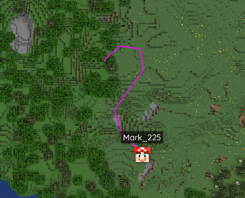

# BMTrails
A player trail addon for BlueMap on Bukkit-based servers running Minecraft version 1.13 and up.

## What it does
As the name suggests, this plugin creates BlueMap line markers visualizing recent movements of every player. It is designed to be pretty much plug&play but still offers high amounts of customizability.
  
In its default configuration, the plugin will show the path every player took within the last minute, sampling their positions once every second. It also generates a persistent random color for every player so you can tell their trails apart at a glance and recognize them even across rejoins.

## Configuration
The following aspects of this plugin are configurable:
- Default color can be random or a predefined hex code
- Position sampling interval (for more/less precise trails)
- Maximum points per trail line (for longer/shorter trails)
- Markerset name, default visibility and toggleability
- Trail tooltips (when clicked on in the BlueMap webapp)
- Trail line width and max distance to the camera in the webapp
- Optional permission for trail visibility
- Fully customizable trail colors per player, manageable via permissions (e.g. 'bmtrails.color.red' for a red trail)
- Excluded maps, that will never show any player's trail

For more details on how to use each of these config settings, take a look at the [default config template](./src/main/resources/config.yml).

## Other notable features
- Automatic reset of trails on world changes and teleports (configurable minimum distance between sampling points to be considered a "teleportation")
- Automatically hides trails of players that are also hidden in BlueMap's live player markers
- Mostly handled asynchronously on separate threads (theoretically good for performance on large servers)
- Automatically reloads with BlueMap's reload command for live config changes
- No permanent data in unexpected places. Uninstalling without leaving any traces is as simple as removing the jar and config folder, and removing any BMTrails permissions from your permission manager if you used them.

## Known limitations
As these trails are considered normal markers by BlueMap, they are limited to the 10-second fetch interval. That means trails can be up to 10 seconds behind, depending on how well the browser refresh lines up with the most recent trail update.
  
Since the permission-based features need to adapt to player permission changes live, the plugin forces a recalculation of all player permissions every five seconds, if those features are enabled in the config. This may be a performance issue for large servers, but I am unable to properly test this.
  
I have no idea why but permission related config settings sometimes take a restart to apply, yet sometimes a bluemap reload is enough.
